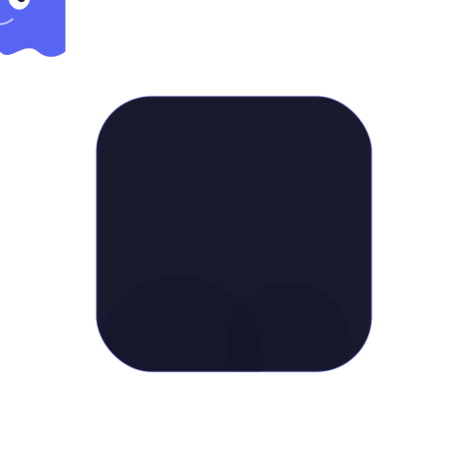

<p align="center">
  
</p>

<h1 align="center">itchcord</h1>

<p align="center">
  <strong>Discord Rich Presence for itch.io games</strong>
</p>

<p align="center">
  
  
  
  
</p>

---

## What is itchcord?

**itchcord** automatically detects when you're playing an itch.io game and displays it as Discord Rich Presence — so your friends can see what you're playing, whether it's a desktop app or a browser game.

<p align="center">
  <em><!-- Screenshot placeholder: Add a screenshot of Discord showing itchcord Rich Presence here --></em><br>
  <code>📸 Screenshot coming soon</code>
</p>

## Features

itchcord uses **three detection sources** to find what you're playing:

| Source | How it works |
|---|---|
| 🖥️ **itch Desktop App Log** | Reads the itch desktop client's log file to detect launched games in real time. |
| 🔍 **Process Scanning** | Scans running processes to identify known itch.io game executables. |
| 🌐 **Chrome Extension** | A bundled browser extension detects itch.io games played directly in the browser. |

**Additional features:**

- 🔔 System tray icon with quick controls and **About UI**
- 🚀 **Runs on startup by default** (cross-platform registry/autostart integration)
- ⏱️ Elapsed play time displayed in Discord
- 🔄 Automatic reconnection to Discord
- 🪶 Lightweight — minimal CPU and memory footprint

## Installation

### Prerequisites

- **Python 3.10** or higher
- **Discord desktop app** (must be running for Rich Presence to work)
- **Google Chrome** (optional, only needed for browser game detection)

### Setup

1. **Clone the repository:**

   ```bash
   git clone https://github.com/yourusername/itchcord.git
   cd itchcord
   ```

2. **Install dependencies:**

   ```bash
   pip install -r requirements.txt
   ```

3. **Run itchcord:**

   ```bash
   python main.py
   ```

   itchcord will start in the system tray. Open Discord and launch an itch.io game to see it in action.

## Chrome Extension Setup

The Chrome extension enables detection of itch.io games played in the browser.

1. Open **Google Chrome** and navigate to `chrome://extensions`
2. Enable **Developer mode** (toggle in the top-right corner)
3. Click **Load unpacked**
4. Select the `extension/` folder from this repository
5. The extension icon should appear in your toolbar — it will communicate with itchcord automatically

> **Note:** The extension requires itchcord to be running. It connects via a local WebSocket to relay the currently active itch.io game page.

## Downloading & Building Binaries

### Automated Cross-Platform Releases
This repository includes a fully automated **GitHub Actions CI/CD** pipeline (`.github/workflows/build.yml`). 
Whenever a new version tag (e.g., `v1.0.0`) is pushed to GitHub, the workflow automatically builds the `itchcord` executables for **Windows**, **macOS**, and **Linux** and attaches them to the GitHub Release.

### Manual Build
You can also package itchcord into a standalone executable manually using PyInstaller:

```bash
pyinstaller itchcord.spec
```

The compiled binary will be in the `dist/` directory.

### Platform Notes

| Platform | Notes |
|---|---|
| **Windows** | Produces `itchcord.exe`. Adds itself to the Run registry key for automatic startup. |
| **Linux** | Requires `libappindicator3` or `libayatana-appindicator` for the system tray icon. Creates a `.desktop` file in `~/.config/autostart` for startup. |
| **macOS** | May require granting accessibility permissions for process scanning. Creates a `.plist` LaunchAgent for startup. |

## Discord Developer Portal Setup

itchcord connects to the Discord API using a registered application. To use the default configuration:

1. Go to the [Discord Developer Portal](https://discord.com/developers/applications)
2. The application ID is **`1515806299445526689`**
3. Under **Rich Presence → Art Assets**, upload the following images:

   | Asset Key | File | Usage |
   |---|---|---|
   | `itch_logo` | `assets/itch_logo.png` | Large image — shown as the main game artwork |
   | `icon_desktop` | `assets/icon_desktop.png` | Small image — indicates game is running as a desktop app |
   | `icon_browser` | `assets/icon_browser.png` | Small image — indicates game is running in the browser |

> **Tip:** If you fork this project, create your own Discord application and update the application ID in the source code.

## Supported Platforms

| Platform | Desktop Detection | Browser Detection | System Tray |
|---|---|---|---|
| ✅ Windows | Full support | Full support | Full support |
| ✅ Linux | Full support | Full support | Requires appindicator |
| ✅ macOS | Full support | Full support | Full support |

## How It Works

```
┌──────────────────┐     ┌──────────────────┐     ┌──────────────────┐
│  itch.io Desktop │     │  Process Scanner │     │ Chrome Extension │
│    Log Watcher   │     │    (psutil)      │     │  (WebSocket)     │
└────────┬─────────┘     └────────┬─────────┘     └────────┬─────────┘
         │                        │                         │
         └────────────┬───────────┴─────────────────────────┘
                      │
              ┌───────▼────────┐
              │  Game Resolver │
              │  (main.py)     │
              └───────┬────────┘
                      │
              ┌───────▼────────┐
              │  pypresence    │
              │  Discord RPC   │
              └───────┬────────┘
                      │
              ┌───────▼────────┐
              │    Discord     │
              │  Rich Presence │
              └────────────────┘
```

1. **Detection** — Three sources independently watch for itch.io games: the itch desktop app log file, system process scanning via `psutil`, and a Chrome extension that communicates over a local WebSocket.

2. **Resolution** — The main process aggregates signals from all three sources and determines which game is currently active, with priority given to the most recently detected source.

3. **Display** — Game information is sent to Discord via `pypresence`, updating your Rich Presence with the game name, elapsed time, and source indicator (desktop or browser icon).

4. **System Tray** — A `pystray` icon sits in your system tray, providing quick access to status information and controls.

## Developer & Contact

**Abhishek Verma**

- 🐙 GitHub: [https://github.com/w3Abhishek/itchcord](https://github.com/w3Abhishek/itchcord)
- ✈️ Telegram: [https://telegram.me/w3Abhishek](https://telegram.me/w3Abhishek)
- 𝕏 (Twitter): [https://x.com/pyvrma](https://x.com/pyvrma)

## License

This project is licensed under the **MIT License**. See [LICENSE](LICENSE) for details.

---

<p align="center">
  Made with ❤️ for the itch.io community by Abhishek Verma
</p>
